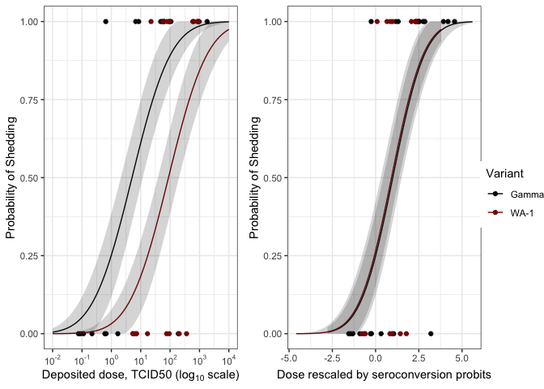

Analysis of Seroconversion and Fever Dose Response Data for SARS-CoV-2
WA-1 and Gamma Variants
================

In this notebook I analyze the seroconversion (PRNT50) and fever
endpoint dose response for WA-1 and Gamma SARS-CoV-2 variants. In a
previous publication we performed bivariate modeling for the two
endpoints simultaneously for just WA-1 and showed that Seroconversion
had a lower median effective dose (D50) than fever. Here I look to
repeat that analysis for the Gamma variant and do a comparison between
the two variants for both endpoints. To provide clarity into the effect
that modeling choices have on our results, I estimate equivalent
parameters and perform similar tests on the effect of the variant using
a standard univariate GLM approach (as opposed to the bivariate model).
In addition to seroconversion and fever, I explore the effect of the
variant on shedding rate. The primary conclusions from this analysis are
that:

-   The original result of seroconversion D50 being significantly lower
    than the fever D50 for the WA-1 strain still holds when using PRNT50
    as the updated seroconversion proxy (as opposed to the IgG ELISA in
    the original publication)
-   The seroconversion D50 is significantly lower than the fever D50 for
    the Gamma a strain as well
-   The seroconversion D50 is significantly lower for Gamma than for
    WA-1
-   The fever D50 is not significantly different for Gamma than for WA-1
-   The shedding D50 is significantly different for Gamma than for WA-1
-   When we transform dose onto the seroconversion probit scale, the
    shedding dose response between the two variants is not significantly
    different

``` r
library(tidyverse)
library(VGAM)
library(emdbook)
library(scales)
library(cowplot)
```

``` r
nbacc_dose_response_data <- read.csv("nbacc_sero_fever.csv")
nbacc_dose_response_data[nbacc_dose_response_data == '-'] <- 0 
nbacc_dose_response_data[nbacc_dose_response_data == '+'] <- 1 
nbacc_dose_response_data[nbacc_dose_response_data == 'ND'] <- NA 

nbacc_dose_response_data$PRNT50_binary <- as.numeric(nbacc_dose_response_data$PRNT50_binary)
nbacc_dose_response_data$PRNT80_binary <- as.numeric(nbacc_dose_response_data$PRNT80_binary)
nbacc_dose_response_data$IgG_ELISA_kit <- as.numeric(nbacc_dose_response_data$IgG_ELISA_kit)
nbacc_dose_response_data$IgG_ELISA_rebase <- as.numeric(nbacc_dose_response_data$IgG_ELISA_rebase)
nbacc_dose_response_data$Fever_binary <- as.numeric(nbacc_dose_response_data$Fever_binary)
nbacc_dose_response_data$Nasal_binary <- ifelse(nbacc_dose_response_data$Nasal_max>0,1,0)
nbacc_dose_response_data$logdose <- as.numeric(nbacc_dose_response_data$logdose)
```

## Question 1: Is the dose response for seroconversion different from the dose response for fever?

This question was one of the primary thrusts of the original study,
which concluded that the median effective dose (D50) values for
seroconversion and fever were different for WA-1. I repeat that analysis
here for completeness and because it was determined that a PRNT50 based
seroconversion assay should be used as opposed to the IgG ELISA kit
assay used in the original study; the change in endpoint does result in
slightly different parameter estimates.

### WA-1 reanalysis of Seroconversion vs Fever

#### Hypothesis 1: Seroconversion and Fever are independent.

Seroconversion and fever were measured on the same subjects and there is
strong biological reasons to believe they are correlated endpoints.
Therefore, I am inclined to analyzed them jointly in a bivariate model.
However, I will also assess the statistical support for their
correlation by analyzing a 2-way contingency table. We can see from the
table that all subjects with fever did serconvert but not all
seroconverters showed fever. This table is suggestive of a dependence of
the two variable. I tested for independence between seroconversion and
fever using Fisher’s exact test:

``` r
cont_table <- table(nbacc_dose_response_data[nbacc_dose_response_data$variant=='WA-1',c("PRNT50_binary","Fever_binary")])
print(cont_table)
```

    ##              Fever_binary
    ## PRNT50_binary 0 1
    ##             0 4 0
    ##             1 6 5

``` r
print(fisher.test(cont_table,alternative = "greater"))
```

    ## 
    ##  Fisher's Exact Test for Count Data
    ## 
    ## data:  cont_table
    ## p-value = 0.1538
    ## alternative hypothesis: true odds ratio is greater than 1
    ## 95 percent confidence interval:
    ##  0.4928521       Inf
    ## sample estimates:
    ## odds ratio 
    ##        Inf

#### Interpretation:

Maybe, results are inconclusive; the test failed to reject the null that
the endpoints are independent. However, the contingency table shows
there are no animals that showed fever and did not seroconvert. I
conclude that despite the lack of statistically significant support the
table itself and the biological reasons for treating the endpoints as
correlated supports a joint analysis.

#### Hypothesis 2: The dose response parameters are the same for fever and seroconversion.

This was the primary analysis performed in the original study. We fit
two bivariate models to the WA-1 dose response data: one in which the
two endpoints have different dose response parameters and another in
which the dose response parameters are forced to be equivalent. The
signifance of the result is assessed by likelihood ratio test.

``` r
wa1_probit_biv <- vglm( cbind(PRNT50_binary,Fever_binary) ~  logdose,
                        family=binom2.or(lmu="probitlink",zero = "or",exchangeable=F),
                        data=filter(nbacc_dose_response_data,variant=='WA-1'),
                        control=vglm.control(stepsize = 0.5,maxit = 1000))

wa1_probit_biv_null <- vglm( cbind(PRNT50_binary,Fever_binary) ~  logdose,
                             family=binom2.or(lmu="probitlink",zero = "or",exchangeable=T),
                             data=filter(nbacc_dose_response_data,variant=='WA-1'),
                             control=vglm.control(stepsize = 0.5,maxit = 1000))

#We use Rao's score stats here due to Hauck-Donner effect (DOI: 10.1080/01621459.2021.1886936)
summary(wa1_probit_biv,lrt0=T)
```

    ## 
    ## Call:
    ## vglm(formula = cbind(PRNT50_binary, Fever_binary) ~ logdose, 
    ##     family = binom2.or(lmu = "probitlink", zero = "or", exchangeable = F), 
    ##     data = filter(nbacc_dose_response_data, variant == "WA-1"), 
    ##     control = vglm.control(stepsize = 0.5, maxit = 1000))
    ## 
    ## Likelihood ratio test coefficients: 
    ##           Estimate z value Pr(>|z|)   
    ## logdose:1    1.539   2.444   0.0145 * 
    ## logdose:2    2.471   3.195   0.0014 **
    ## ---
    ## Signif. codes:  0 '***' 0.001 '**' 0.01 '*' 0.05 '.' 0.1 ' ' 1
    ## 
    ## Names of linear predictors: probitlink(mu1), probitlink(mu2), loglink(oratio)
    ## 
    ## Residual deviance: 19.178 on 40 degrees of freedom
    ## 
    ## Log-likelihood: -9.589 on 40 degrees of freedom
    ## 
    ## Number of Fisher scoring iterations: 46 
    ## 
    ## 
    ## Odds ratio:  449777.7

``` r
teststat <- -2 * (as.numeric(logLik(wa1_probit_biv_null))-as.numeric(logLik(wa1_probit_biv)))
p.val <- pchisq(teststat, df = length(coef(wa1_probit_biv)) -length(coef(wa1_probit_biv_null)), lower.tail = FALSE)
print(p.val)
```

    ## [1] 0.01218651

#### Interpretation:

The data allow us to reject the hypothesis that serconversion and fever
should be modeled with the same dose response parameters (p=0.0122;
LRT). Therefore, we conclude that serconversion and fever are likely to
have different dose response curves.

#### Hypothesis 3: Is fever conditionally independent of dose when seroconversion is taken into account?

The null hypothesis in this case is that the probability of developing
fever given seroconversion is not dependent upon dose. In other words,
the dose response curve for fever is attributable to a dependence of
fever on seroconversion, which in turn is dose-dependent. We test this
hypothesis by fitting two univariate GLMs: a model where fever is a
function of seroconversion only and another where fever is a function of
seroconversion and dose; the models are compared by LRT.

``` r
wa1_probit_fever_sero <- glm(Fever_binary ~ PRNT50_binary,family=binomial(link="probit"),
                             data=filter(nbacc_dose_response_data,variant=='WA-1'))

wa1_probit_fever_sero_dose <- glm(Fever_binary ~ PRNT50_binary + logdose,family=binomial(link="probit"),
                                  data=filter(nbacc_dose_response_data,variant=='WA-1'))

#Wald stat is fine here
summary(wa1_probit_fever_sero_dose)
```

    ## 
    ## Call:
    ## glm(formula = Fever_binary ~ PRNT50_binary + logdose, family = binomial(link = "probit"), 
    ##     data = filter(nbacc_dose_response_data, variant == "WA-1"))
    ## 
    ## Deviance Residuals: 
    ##     Min       1Q   Median       3Q      Max  
    ## -1.4597  -0.4324   0.0000   0.4291   1.9052  
    ## 
    ## Coefficients:
    ##               Estimate Std. Error z value Pr(>|z|)  
    ## (Intercept)    -10.064    988.480  -0.010   0.9919  
    ## PRNT50_binary    4.360    988.478   0.004   0.9965  
    ## logdose          2.384      1.157   2.061   0.0393 *
    ## ---
    ## Signif. codes:  0 '***' 0.001 '**' 0.01 '*' 0.05 '.' 0.1 ' ' 1
    ## 
    ## (Dispersion parameter for binomial family taken to be 1)
    ## 
    ##     Null deviance: 19.0954  on 14  degrees of freedom
    ## Residual deviance:  8.5763  on 12  degrees of freedom
    ##   (1 observation deleted due to missingness)
    ## AIC: 14.576
    ## 
    ## Number of Fisher Scoring iterations: 18

``` r
teststat <- -2 * (as.numeric(logLik(wa1_probit_fever_sero))-as.numeric(logLik(wa1_probit_fever_sero_dose)))
p.val <- pchisq(teststat, df = 1, lower.tail = FALSE)
p.val
```

    ## [1] 0.0103022

#### Interpretation:

The data allow us to reject the hypothesis that fever is independent of
dose when seroconversion status is taken into account (p=0.01; LRT)

#### Conclusion from the WA-1 reanalysis:

-   Seroconversion and fever are best modeled with different dose
    response parameters (LRT test p=0.012)
-   Fever is still dose dependent when conditioned on seroconversion;
    given an infection takes place the likelihood of being symptomatic
    is dose dependent (LRT test p=0.01).

### Repeat of Seroconversion vs Fever analysis for Gamma variant

#### Hypothesis 1: Are Seroconversion and Fever independent?

``` r
cont_table <- table(nbacc_dose_response_data[nbacc_dose_response_data$variant=='Gamma',c("PRNT50_binary","Fever_binary")])

print(cont_table)
```

    ##              Fever_binary
    ## PRNT50_binary 0 1
    ##             0 6 0
    ##             1 9 6

``` r
fisher.test(cont_table,alternative = "greater")
```

    ## 
    ##  Fisher's Exact Test for Count Data
    ## 
    ## data:  cont_table
    ## p-value = 0.09223
    ## alternative hypothesis: true odds ratio is greater than 1
    ## 95 percent confidence interval:
    ##  0.7204938       Inf
    ## sample estimates:
    ## odds ratio 
    ##        Inf

#### Interpretation:

Maybe, results are inconclusive; the test failed to reject the null that
the endpoints are independent. However, the contingency table shows
there are no animals that showed fever and did not seroconvert.

#### Hypothesis 2: Are the dose response parameters the same for fever and seroconversion?

``` r
gamma_probit_biv <- vglm( cbind(PRNT50_binary,Fever_binary) ~  logdose,
                          family=binom2.or(lmu="probitlink",zero = "or",exchangeable=F),
                          data=filter(nbacc_dose_response_data,variant=='Gamma'),
                          control=vglm.control(stepsize = 0.5,maxit = 1000))

gamma_probit_biv_null <- vglm( cbind(PRNT50_binary,Fever_binary) ~  logdose,
                               family=binom2.or(lmu="probitlink",zero = "or",exchangeable=T),
                               data=filter(nbacc_dose_response_data,variant=='Gamma'),
                               control=vglm.control(stepsize = 0.5,maxit = 1000))
#We use Rao's score stats here due to Hauck-Donner effect (DOI: 10.1080/01621459.2021.1886936)
summary(gamma_probit_biv,lrt0=T)
```

    ## 
    ## Call:
    ## vglm(formula = cbind(PRNT50_binary, Fever_binary) ~ logdose, 
    ##     family = binom2.or(lmu = "probitlink", zero = "or", exchangeable = F), 
    ##     data = filter(nbacc_dose_response_data, variant == "Gamma"), 
    ##     control = vglm.control(stepsize = 0.5, maxit = 1000))
    ## 
    ## Likelihood ratio test coefficients: 
    ##           Estimate z value Pr(>|z|)    
    ## logdose:1    1.313   3.669 0.000243 ***
    ## logdose:2    1.340   3.374 0.000741 ***
    ## ---
    ## Signif. codes:  0 '***' 0.001 '**' 0.01 '*' 0.05 '.' 0.1 ' ' 1
    ## 
    ## Names of linear predictors: probitlink(mu1), probitlink(mu2), loglink(oratio)
    ## 
    ## Residual deviance: 24.0364 on 58 degrees of freedom
    ## 
    ## Log-likelihood: -12.0182 on 58 degrees of freedom
    ## 
    ## Number of Fisher scoring iterations: 37 
    ## 
    ## 
    ## Odds ratio:  112803.6

``` r
teststat <- -2 * (as.numeric(logLik(gamma_probit_biv_null))-as.numeric(logLik(gamma_probit_biv)))
p.val <- pchisq(teststat, df = length(coef(gamma_probit_biv)) -length(coef(gamma_probit_biv_null)), lower.tail = FALSE)
p.val
```

    ## [1] 0.00141975

#### Interpretation:

The data allow us to reject the hypothesis that serconversion and fever
should be modeled with the same dose response parameters (p=0.0014;LRT)

#### Hypothesis 3: Is fever conditional on seroconversion independent of dose?

``` r
gamma_probit_fever_sero <- glm(Fever_binary ~ PRNT50_binary,family=binomial(link="probit"),
                               data=filter(nbacc_dose_response_data,variant=='Gamma'))

gamma_probit_fever_sero_dose <- glm(Fever_binary ~ PRNT50_binary + logdose,family=binomial(link="probit"),
                                    data=filter(nbacc_dose_response_data,variant=='Gamma'))

#Wald stat is fine here
summary(gamma_probit_fever_sero_dose)
```

    ## 
    ## Call:
    ## glm(formula = Fever_binary ~ PRNT50_binary + logdose, family = binomial(link = "probit"), 
    ##     data = filter(nbacc_dose_response_data, variant == "Gamma"))
    ## 
    ## Deviance Residuals: 
    ##     Min       1Q   Median       3Q      Max  
    ## -1.4403  -0.3318   0.0000   0.3232   1.4597  
    ## 
    ## Coefficients:
    ##               Estimate Std. Error z value Pr(>|z|)  
    ## (Intercept)    -6.5800   816.5817  -0.008   0.9936  
    ## PRNT50_binary   4.0150   816.5819   0.005   0.9961  
    ## logdose         1.2887     0.6508   1.980   0.0477 *
    ## ---
    ## Signif. codes:  0 '***' 0.001 '**' 0.01 '*' 0.05 '.' 0.1 ' ' 1
    ## 
    ## (Dispersion parameter for binomial family taken to be 1)
    ## 
    ##     Null deviance: 25.127  on 20  degrees of freedom
    ## Residual deviance: 12.784  on 18  degrees of freedom
    ## AIC: 18.784
    ## 
    ## Number of Fisher Scoring iterations: 18

``` r
teststat <- -2 * (as.numeric(logLik(gamma_probit_fever_sero))-as.numeric(logLik(gamma_probit_fever_sero_dose)))
p.val <- pchisq(teststat, df = 1, lower.tail = FALSE)
p.val
```

    ## [1] 0.006500045

#### Interpretation:

The data allow us to reject the hypothesis that fever is not dose
dependent when conditioned up seroconversion status (p=0.007; LRT)

### Conclusion from the Gamma analysis:

-   Seroconversion and fever are best modeled with different dose
    response parameters (p=0.0014)
-   Fever is still dose dependent when conditioned on seroconversion;
    given an infection takes place the likelihood of being symptomatic
    is dose dependent.(p=0.007)
-   This result is entirely consistent with the results obtained from
    WA-1

## Question 2: Is the dose response for the Gamma variant different from the dose response for WA-1?

This question can be interrogated from several different angles. Given
that a bivariate model of seroconversion and fever was supported for
both the Gamma and WA-1 variants individually, I am inclined to propose
using a bivariate model to assess the effect of the variant. However, I
will also provide similar analysis based on more standard univariate
models.

#### Hypothesis: The bivariate sero/fever dose response is independent of the variant type.

To assess the overall effect of the variant on the bivariate dose
response, I fit three different models:

-   A bivariate probit model with different intercepts for each variant
-   A bivariate probit model with different intercepts and slopes for
    each variant
-   A bivariate probit model with no variant effect (pooled)

``` r
joint_probit_biv <- vglm( cbind(PRNT50_binary,Fever_binary) ~ variant + logdose,
                          family=binom2.or(lmu="probitlink",zero = "or",exchangeable=F),
                          data=nbacc_dose_response_data,
                          control=vglm.control(stepsize = 0.5,maxit = 1000))

joint_probit_biv_interact <- vglm( cbind(PRNT50_binary,Fever_binary) ~ variant * logdose,
                                   family=binom2.or(lmu="probitlink",zero = "or",exchangeable=F),
                                   data=nbacc_dose_response_data,
                                   control=vglm.control(stepsize = 0.5,maxit = 1000))

joint_probit_biv_null <- vglm( cbind(PRNT50_binary,Fever_binary) ~  logdose,
                               family=binom2.or(lmu="probitlink",zero = "or",exchangeable=F),
                               data=nbacc_dose_response_data,
                               control=vglm.control(stepsize = 0.5,maxit = 1000))

#We use LRT stats here due to Hauck-Donner effect (DOI: 10.1080/01621459.2021.1886936)
summary(joint_probit_biv,lrt0=T)
```

    ## 
    ## Call:
    ## vglm(formula = cbind(PRNT50_binary, Fever_binary) ~ variant + 
    ##     logdose, family = binom2.or(lmu = "probitlink", zero = "or", 
    ##     exchangeable = F), data = nbacc_dose_response_data, control = vglm.control(stepsize = 0.5, 
    ##     maxit = 1000))
    ## 
    ## Likelihood ratio test coefficients: 
    ##               Estimate z value Pr(>|z|)    
    ## variantWA-1:1   -1.807  -2.297   0.0216 *  
    ## variantWA-1:2   -0.834  -1.314   0.1887    
    ## logdose:1        1.397   4.436 9.15e-06 ***
    ## logdose:2        1.762   4.565 5.00e-06 ***
    ## ---
    ## Signif. codes:  0 '***' 0.001 '**' 0.01 '*' 0.05 '.' 0.1 ' ' 1
    ## 
    ## Names of linear predictors: probitlink(mu1), probitlink(mu2), loglink(oratio)
    ## 
    ## Residual deviance: 44.0269 on 101 degrees of freedom
    ## 
    ## Log-likelihood: -22.0135 on 101 degrees of freedom
    ## 
    ## Number of Fisher scoring iterations: 49 
    ## 
    ## 
    ## Odds ratio:  345000.9

``` r
summary(joint_probit_biv_interact,lrt0=T)
```

    ## 
    ## Call:
    ## vglm(formula = cbind(PRNT50_binary, Fever_binary) ~ variant * 
    ##     logdose, family = binom2.or(lmu = "probitlink", zero = "or", 
    ##     exchangeable = F), data = nbacc_dose_response_data, control = vglm.control(stepsize = 0.5, 
    ##     maxit = 1000))
    ## 
    ## Likelihood ratio test coefficients: 
    ##                       Estimate z value Pr(>|z|)    
    ## variantWA-1:1          -2.0616  -1.648 0.099331 .  
    ## variantWA-1:2          -3.3037  -1.132 0.257686    
    ## logdose:1               1.3129   3.669 0.000243 ***
    ## logdose:2               1.3400   3.374 0.000741 ***
    ## variantWA-1:logdose:1   0.2258   0.241 0.809521    
    ## variantWA-1:logdose:2   1.1313   0.867 0.385948    
    ## ---
    ## Signif. codes:  0 '***' 0.001 '**' 0.01 '*' 0.05 '.' 0.1 ' ' 1
    ## 
    ## Names of linear predictors: probitlink(mu1), probitlink(mu2), loglink(oratio)
    ## 
    ## Residual deviance: 43.2144 on 99 degrees of freedom
    ## 
    ## Log-likelihood: -21.6072 on 99 degrees of freedom
    ## 
    ## Number of Fisher scoring iterations: 45 
    ## 
    ## 
    ## Odds ratio:  356672.6

``` r
teststat <- -2 * (as.numeric(logLik(joint_probit_biv_null))-as.numeric(logLik(joint_probit_biv)))
p.val <- pchisq(teststat, df = length(coef(joint_probit_biv)) - length(coef(joint_probit_biv_null)) , lower.tail = FALSE)
p.val 
```

    ## [1] 0.0406754

#### Interpretation:

The data allow us to reject the null hypothesis that the variant has no
effect on the response (p=0.04; LRT). Importantly, this overall effect
appears to be primarily driven by a variant effect on the seroconversion
endpoint (p=0.02; LRT)

#### Hypothesis: The intercepts and slopes of the bivariate sero/fever response is independent of the variant type

``` r
teststat <- -2 * (as.numeric(logLik(joint_probit_biv_null))-as.numeric(logLik(joint_probit_biv_interact)))
p.val <- pchisq(teststat, df = length(coef(joint_probit_biv_interact)) - length(coef(joint_probit_biv_null)) , lower.tail = FALSE)
p.val 
```

    ## [1] 0.1248678

``` r
teststat <- -2 * (as.numeric(logLik(joint_probit_biv))-as.numeric(logLik(joint_probit_biv_interact)))
p.val <- pchisq(teststat, df = length(coef(joint_probit_biv_interact)) - length(coef(joint_probit_biv)) , lower.tail = FALSE)
p.val 
```

    ## [1] 0.6661479

``` r
anova(joint_probit_biv_null,joint_probit_biv,joint_probit_biv_interact,test = 'LRT',type='I')
```

    ## Analysis of Deviance Table
    ## 
    ## Model 1: cbind(PRNT50_binary, Fever_binary) ~ logdose
    ## Model 2: cbind(PRNT50_binary, Fever_binary) ~ variant + logdose
    ## Model 3: cbind(PRNT50_binary, Fever_binary) ~ variant * logdose
    ##   Resid. Df Resid. Dev Df Deviance Pr(>Chi)  
    ## 1       103     50.431                       
    ## 2       101     44.027  2   6.4043  0.04068 *
    ## 3        99     43.214  2   0.8125  0.66615  
    ## ---
    ## Signif. codes:  0 '***' 0.001 '**' 0.01 '*' 0.05 '.' 0.1 ' ' 1

#### Interpretation:

The data do not allow us to reject the null hypothesis that the variant
has an effect on the slope of the bivariate dose response.

### Conclusion from bivariate comparison between variants:

The bivariate modeling results suggest that the variant has an overall
effect (LRT test p=0.04) on the intercepts but not the slope of the
response. Specifically, the variant effect is only significant for the
intercept of the seroconversion endpoint (p=0.02; LRT).

### Is this result supported by looking at individual endpoints in a univariate modeling framework?

``` r
joint_probit_sero <- glm(PRNT50_binary ~ variant + logdose,family=binomial(link="probit"),
                         data=nbacc_dose_response_data)

joint_probit_sero_interact <- glm(PRNT50_binary ~ variant * logdose,family=binomial(link="probit"),
                                  data=nbacc_dose_response_data)

joint_probit_sero_null <- glm(PRNT50_binary ~ logdose,family=binomial(link="probit"),
                              data=nbacc_dose_response_data)

summary(joint_probit_sero)
```

    ## 
    ## Call:
    ## glm(formula = PRNT50_binary ~ variant + logdose, family = binomial(link = "probit"), 
    ##     data = nbacc_dose_response_data)
    ## 
    ## Deviance Residuals: 
    ##     Min       1Q   Median       3Q      Max  
    ## -2.0323  -0.3728   0.1277   0.5508   1.5284  
    ## 
    ## Coefficients:
    ##             Estimate Std. Error z value Pr(>|z|)   
    ## (Intercept)  0.01826    0.43143   0.042  0.96623   
    ## variantWA-1 -1.62116    0.88686  -1.828  0.06755 . 
    ## logdose      1.35349    0.43216   3.132  0.00174 **
    ## ---
    ## Signif. codes:  0 '***' 0.001 '**' 0.01 '*' 0.05 '.' 0.1 ' ' 1
    ## 
    ## (Dispersion parameter for binomial family taken to be 1)
    ## 
    ##     Null deviance: 43.181  on 36  degrees of freedom
    ## Residual deviance: 23.319  on 34  degrees of freedom
    ## AIC: 29.319
    ## 
    ## Number of Fisher Scoring iterations: 7

``` r
summary(joint_probit_sero_interact)
```

    ## 
    ## Call:
    ## glm(formula = PRNT50_binary ~ variant * logdose, family = binomial(link = "probit"), 
    ##     data = nbacc_dose_response_data)
    ## 
    ## Deviance Residuals: 
    ##     Min       1Q   Median       3Q      Max  
    ## -2.0129  -0.3874   0.1248   0.5398   1.5543  
    ## 
    ## Coefficients:
    ##                     Estimate Std. Error z value Pr(>|z|)  
    ## (Intercept)          0.02088    0.42703   0.049    0.961  
    ## variantWA-1         -1.69967    1.21583  -1.398    0.162  
    ## logdose              1.32129    0.54311   2.433    0.015 *
    ## variantWA-1:logdose  0.08240    0.88359   0.093    0.926  
    ## ---
    ## Signif. codes:  0 '***' 0.001 '**' 0.01 '*' 0.05 '.' 0.1 ' ' 1
    ## 
    ## (Dispersion parameter for binomial family taken to be 1)
    ## 
    ##     Null deviance: 43.181  on 36  degrees of freedom
    ## Residual deviance: 23.311  on 33  degrees of freedom
    ## AIC: 31.311
    ## 
    ## Number of Fisher Scoring iterations: 7

``` r
anova(joint_probit_sero_null,joint_probit_sero,joint_probit_sero_interact,test = 'LRT',type='I')
```

    ## Analysis of Deviance Table
    ## 
    ## Model 1: PRNT50_binary ~ logdose
    ## Model 2: PRNT50_binary ~ variant + logdose
    ## Model 3: PRNT50_binary ~ variant * logdose
    ##   Resid. Df Resid. Dev Df Deviance Pr(>Chi)  
    ## 1        35     27.874                       
    ## 2        34     23.319  1   4.5548  0.03283 *
    ## 3        33     23.311  1   0.0083  0.92736  
    ## ---
    ## Signif. codes:  0 '***' 0.001 '**' 0.01 '*' 0.05 '.' 0.1 ' ' 1

``` r
# Hypothesis: the variant has no effect on the seroconversion response
teststat <- -2 * (as.numeric(logLik(joint_probit_sero_null))-as.numeric(logLik(joint_probit_sero)))
p.val <- pchisq(teststat, df = 1 , lower.tail = FALSE)
p.val 
```

    ## [1] 0.03282634

#### Interpretation:

The data allow us to reject the null that the variant has no effect on
the intercept of seroconversion.

``` r
joint_probit_fever <- glm(Fever_binary ~ variant + logdose,family=binomial(link="probit"),
                          data=nbacc_dose_response_data)

joint_probit_fever_interact <- glm(Fever_binary ~ variant * logdose,family=binomial(link="probit"),
                                   data=nbacc_dose_response_data)

joint_probit_fever_null <- glm(Fever_binary ~ logdose,family=binomial(link="probit"),
                               data=nbacc_dose_response_data)

summary(joint_probit_fever)
```

    ## 
    ## Call:
    ## glm(formula = Fever_binary ~ variant + logdose, family = binomial(link = "probit"), 
    ##     data = nbacc_dose_response_data)
    ## 
    ## Deviance Residuals: 
    ##      Min        1Q    Median        3Q       Max  
    ## -1.56572  -0.50674  -0.02365   0.29063   1.78549  
    ## 
    ## Coefficients:
    ##             Estimate Std. Error z value Pr(>|z|)   
    ## (Intercept)  -3.5879     1.3043  -2.751  0.00595 **
    ## variantWA-1  -0.8301     0.6675  -1.243  0.21368   
    ## logdose       1.8118     0.6372   2.843  0.00446 **
    ## ---
    ## Signif. codes:  0 '***' 0.001 '**' 0.01 '*' 0.05 '.' 0.1 ' ' 1
    ## 
    ## (Dispersion parameter for binomial family taken to be 1)
    ## 
    ##     Null deviance: 44.316  on 35  degrees of freedom
    ## Residual deviance: 22.504  on 33  degrees of freedom
    ##   (1 observation deleted due to missingness)
    ## AIC: 28.504
    ## 
    ## Number of Fisher Scoring iterations: 8

``` r
summary(joint_probit_fever_interact)
```

    ## 
    ## Call:
    ## glm(formula = Fever_binary ~ variant * logdose, family = binomial(link = "probit"), 
    ##     data = nbacc_dose_response_data)
    ## 
    ## Deviance Residuals: 
    ##      Min        1Q    Median        3Q       Max  
    ## -1.44636  -0.39904  -0.03339   0.41308   1.98675  
    ## 
    ## Coefficients:
    ##                     Estimate Std. Error z value Pr(>|z|)  
    ## (Intercept)          -2.7266     1.2831  -2.125   0.0336 *
    ## variantWA-1          -3.3654     2.9601  -1.137   0.2556  
    ## logdose               1.3616     0.6396   2.129   0.0333 *
    ## variantWA-1:logdose   1.1672     1.2789   0.913   0.3614  
    ## ---
    ## Signif. codes:  0 '***' 0.001 '**' 0.01 '*' 0.05 '.' 0.1 ' ' 1
    ## 
    ## (Dispersion parameter for binomial family taken to be 1)
    ## 
    ##     Null deviance: 44.316  on 35  degrees of freedom
    ## Residual deviance: 21.711  on 32  degrees of freedom
    ##   (1 observation deleted due to missingness)
    ## AIC: 29.711
    ## 
    ## Number of Fisher Scoring iterations: 8

``` r
anova(joint_probit_fever_null,joint_probit_fever,joint_probit_fever_interact,test = 'LRT')
```

    ## Analysis of Deviance Table
    ## 
    ## Model 1: Fever_binary ~ logdose
    ## Model 2: Fever_binary ~ variant + logdose
    ## Model 3: Fever_binary ~ variant * logdose
    ##   Resid. Df Resid. Dev Df Deviance Pr(>Chi)
    ## 1        34     24.205                     
    ## 2        33     22.504  1  1.70101   0.1922
    ## 3        32     21.711  1  0.79358   0.3730

``` r
# Hypothesis: The variant has no effect on the fever response
teststat <- -2 * (as.numeric(logLik(joint_probit_fever_null))-as.numeric(logLik(joint_probit_fever)))
p.val <- pchisq(teststat, df = 1 , lower.tail = FALSE)
p.val 
```

    ## [1] 0.1921555

#### Interpretation:

The data do not allow us to reject the null that the variant has no
effect on fever dose response

### Conclusions from comparing the both endpoints between the two variants within univariate modeling frameworks:

-   The univariate models suggest that:
-   there is an overall effect of the variant on the dose response
    intercept for seroconversion (p=0.032; LRT)
-   there is no overall effect of the variant on the dose response
    intercept for fever (p=0.19; LRT)
-   There is no signficant effect of the variant on the dose response
    slope for either seroconversion or fever
-   The bivariate and univariate models are consistent in that the
    variant effect size estimates are similar and that only the variant
    effect on seroconversion is statistically significant.

## Question 3: What are the the MLE’s and confidence intervals for the D50 values for both endpoints and variant types?

The univariate modeling results reach the same conclusions as the
bivariate model. Therefore, given our previous discussion about the
utility of the bivariate model I choose to report the primary estimates
that are obtained from the bivariate model, which are slightly different
from the univariate estimates. To obtain the confidence intervals from
the bivariate model I apply the [bias corrected accelerated
bootstrap](https://doi.org/10.2307/2289144) procedure.

``` r
biv_mle_pars <- coef(joint_probit_biv)
biv_mle_vcov <- vcov(joint_probit_biv)

wa1_sero_logD50_mle <- -(biv_mle_pars[1] + biv_mle_pars[4])/(biv_mle_pars[6])
gamma_sero_logD50_mle <- -(biv_mle_pars[1])/biv_mle_pars[6]

wa1_fever_logD50_mle <- -(biv_mle_pars[2] + biv_mle_pars[5])/(biv_mle_pars[7])
gamma_fever_logD50_mle <- -(biv_mle_pars[2])/biv_mle_pars[7]


### WA-1 Sero vs Fever
wa1_sero_logd50_se <- sqrt(deltavar((-(b0+b1)/b2),
                                    meanval = c(b0 = as.numeric(biv_mle_pars[1]), 
                                                b1 = as.numeric(biv_mle_pars[4]),
                                                b2 = as.numeric(biv_mle_pars[6])),
                                    Sigma = as.matrix(biv_mle_vcov[c(1,4,6),c(1,4,6)])
)
)

wa1_fever_logd50_se <- sqrt(deltavar((-(b0+b1)/b2),
                                     meanval = c(b0 = as.numeric(biv_mle_pars[2]), 
                                                 b1 = as.numeric(biv_mle_pars[5]),
                                                 b2 = as.numeric(biv_mle_pars[7])),
                                     Sigma = as.matrix(biv_mle_vcov[c(2,5,7),c(2,5,7)])
)
)

wa1_diff_se <- sqrt(deltavar( (-(b0+b2)/b4) - (-(b1+b3)/b5),
                              meanval = c(b0 = as.numeric(biv_mle_pars[1]), 
                                          b1 = as.numeric(biv_mle_pars[2]),
                                          b2 = as.numeric(biv_mle_pars[4]), 
                                          b3 = as.numeric(biv_mle_pars[5]),
                                          b4 = as.numeric(biv_mle_pars[6]),
                                          b5 = as.numeric(biv_mle_pars[7])
                              ),
                              Sigma = as.matrix(biv_mle_vcov[c(1,2,4,5,6,7),c(1,2,4,5,6,7)])
)
)

wa1_obs_diff_stat <- ((wa1_sero_logD50_mle - wa1_fever_logD50_mle))/wa1_diff_se


### Gamma Sero vs Fever
gamma_sero_logd50_se <- sqrt(deltavar((-b0/b1),
                                      meanval = c(b0 = as.numeric(biv_mle_pars[1]), 
                                                  b1 = as.numeric(biv_mle_pars[6])),
                                      Sigma = as.matrix(biv_mle_vcov[c(1,6),c(1,6)])
)
)

gamma_fever_logd50_se <- sqrt(deltavar((-b0/b1),
                                       meanval = c(b0 = as.numeric(biv_mle_pars[2]), 
                                                   b1 = as.numeric(biv_mle_pars[7])),
                                       Sigma = as.matrix(biv_mle_vcov[c(2,7),c(2,7)])
)
)

gamma_diff_se <- sqrt(deltavar( (-b0/b2) - (-b1/b3),
                                meanval = c(b0 = as.numeric(biv_mle_pars[1]), 
                                            b1 = as.numeric(biv_mle_pars[2]),
                                            b2 = as.numeric(biv_mle_pars[6]),
                                            b3 = as.numeric(biv_mle_pars[7])
                                ),
                                Sigma = as.matrix(biv_mle_vcov[c(1,2,6,7),c(1,2,6,7)])
)
)

gamma_obs_diff_stat <- ((gamma_sero_logD50_mle - gamma_fever_logD50_mle))/gamma_diff_se

### Sero WA-1 vs Gamma
sero_diff_se <- sqrt(deltavar( (-(b0+b1)/b2) - (-b0/b2), ## Could likely be simplified algebraically
                               meanval = c(b0 = as.numeric(biv_mle_pars[1]), 
                                           b1 = as.numeric(biv_mle_pars[4]),
                                           b2 = as.numeric(biv_mle_pars[6])
                               ),
                               Sigma = as.matrix(biv_mle_vcov[c(1,4,6),c(1,4,6)])
)
)

fever_diff_se <- sqrt(deltavar( (-(b0+b1)/b2) - (-b0/b2), ## Could likely be simplified algebraically
                                meanval = c(b0 = as.numeric(biv_mle_pars[2]), 
                                            b1 = as.numeric(biv_mle_pars[5]),
                                            b2 = as.numeric(biv_mle_pars[7])
                                ),
                                Sigma = as.matrix(biv_mle_vcov[c(2,5,7),c(2,5,7)])
)
)

sero_obs_diff_stat <- ((wa1_sero_logD50_mle - gamma_sero_logD50_mle))/sero_diff_se

fever_obs_diff_stat <- ((wa1_fever_logD50_mle - gamma_fever_logD50_mle))/fever_diff_se


### Fever WA-1 vs Gamma
set.seed(101)
B <- 2000
boot_d50s <- list()
for(bi in 1:B){
  
  boot_data <- nbacc_dose_response_data[c(sample(which(nbacc_dose_response_data$variant == "Gamma"),replace=T),
                                          sample(which(nbacc_dose_response_data$variant == "WA-1"),replace=T)),]
  #row.names(boot_data) <- NULL
  out <- tryCatch(
    {
      
      boot_biv <- vglm( cbind(PRNT50_binary,Fever_binary) ~ variant + logdose,
                        family=binom2.or(lmu="probitlink",zero = "or",exchangeable=F),
                        data=boot_data,
                        control=vglm.control(stepsize = 0.5,maxit = 1000))
      
      
      boot_biv_mle_pars <- coef(boot_biv)
      boot_biv_mle_vcov <- vcov(boot_biv)
      
      boot_wa1_sero_logD50_mle <- -(boot_biv_mle_pars[1] + boot_biv_mle_pars[4])/(boot_biv_mle_pars[6])
      boot_gamma_sero_logD50_mle <- -(boot_biv_mle_pars[1])/boot_biv_mle_pars[6]
      
      boot_wa1_fever_logD50_mle <- -(boot_biv_mle_pars[2] + boot_biv_mle_pars[5])/(boot_biv_mle_pars[7])
      boot_gamma_fever_logD50_mle <- -(boot_biv_mle_pars[2])/boot_biv_mle_pars[7]
      
      ### WA-1 Sero vs Fever
      boot_wa1_diff_se <- sqrt(deltavar( (-(b0+b2)/b4) - (-(b1+b3)/b5),
                                         meanval = c(b0 = as.numeric(boot_biv_mle_pars[1]), 
                                                     b1 = as.numeric(boot_biv_mle_pars[2]),
                                                     b2 = as.numeric(boot_biv_mle_pars[4]), 
                                                     b3 = as.numeric(boot_biv_mle_pars[5]),
                                                     b4 = as.numeric(boot_biv_mle_pars[6]),
                                                      b5 = as.numeric(boot_biv_mle_pars[7])
                                         ),
                                         Sigma = as.matrix(boot_biv_mle_vcov[c(1,2,4,5,6,7),c(1,2,4,5,6,7)])
      )
      )
        
      ### Gamma Sero vs Fever
      boot_gamma_diff_se <- sqrt(deltavar( (-b0/b2) - (-b1/b3),
                                           meanval = c(b0 = as.numeric(boot_biv_mle_pars[1]), 
                                                       b1 = as.numeric(boot_biv_mle_pars[2]),
                                                       b2 = as.numeric(boot_biv_mle_pars[6]),
                                                       b3 = as.numeric(boot_biv_mle_pars[7])
                                           ),
                                           Sigma = as.matrix(boot_biv_mle_vcov[c(1,2,6,7),c(1,2,6,7)])
      )
      )
      
      ### Sero WA-1 vs Gamma
      boot_sero_diff_se <- sqrt(deltavar( (-(b0+b1)/b2) - (-b0/b2), ## Could likely be simplified algebraically
                                          meanval = c(b0 = as.numeric(boot_biv_mle_pars[1]), 
                                                      b1 = as.numeric(boot_biv_mle_pars[4]),
                                                      b2 = as.numeric(boot_biv_mle_pars[6])
                                          ),
                                          Sigma = as.matrix(boot_biv_mle_vcov[c(1,4,6),c(1,4,6)])
      )
      )
      
      boot_fever_diff_se <- sqrt(deltavar( (-(b0+b1)/b2) - (-b0/b2), ## Could likely be simplified algebraically
                                           meanval = c(b0 = as.numeric(boot_biv_mle_pars[2]), 
                                                       b1 = as.numeric(boot_biv_mle_pars[5]),
                                                       b2 = as.numeric(boot_biv_mle_pars[7])
                                           ),
                                           Sigma = as.matrix(boot_biv_mle_vcov[c(2,5,7),c(2,5,7)])
      )
      )
      
      boot_wa1_diff_stat <- ((boot_wa1_sero_logD50_mle - boot_wa1_fever_logD50_mle) - (wa1_sero_logD50_mle - wa1_fever_logD50_mle))/boot_wa1_diff_se
      boot_gamma_diff_stat <-((boot_gamma_sero_logD50_mle - boot_gamma_fever_logD50_mle) - (gamma_sero_logD50_mle - gamma_fever_logD50_mle))/boot_gamma_diff_se
      boot_sero_diff_stat <- ((boot_wa1_sero_logD50_mle - boot_gamma_sero_logD50_mle) - (wa1_sero_logD50_mle - gamma_sero_logD50_mle))/boot_sero_diff_se
      boot_fever_diff_stat <- ((boot_wa1_fever_logD50_mle - boot_gamma_fever_logD50_mle) - (wa1_fever_logD50_mle - gamma_fever_logD50_mle))/boot_fever_diff_se
      
      c(boot_wa1_sero_logD50_mle,10^boot_wa1_sero_logD50_mle,
        boot_gamma_sero_logD50_mle,10^boot_gamma_sero_logD50_mle,
        boot_wa1_fever_logD50_mle,10^boot_wa1_fever_logD50_mle,
        boot_gamma_fever_logD50_mle,10^boot_gamma_fever_logD50_mle,
        boot_wa1_diff_stat,boot_gamma_diff_stat,boot_sero_diff_stat,boot_fever_diff_stat,
        boot_biv_mle_pars[1],boot_biv_mle_pars[2],boot_biv_mle_pars[4],boot_biv_mle_pars[5],boot_biv_mle_pars[6],boot_biv_mle_pars[7])
      
    },
    error=function(cond){
      return(c(NA,NA,
               NA,NA,
               NA,NA,
               NA,NA,
               NA,NA,NA,NA,
               NA,NA,NA,NA,NA,NA))
    }
    
  )
  
  boot_d50s[[length(boot_d50s)+1]] <- out
}
 
boot_d50_df <- na.omit(setNames(
  data.frame(do.call("rbind",boot_d50s)),
  c("wa1_sero_logD50","wa1_sero_D50",
    "gamma_sero_logD50","gamma_sero_D50",
    "wa1_fever_logD50","wa1_fever_D50",
    "gamma_fever_logD50","gamma_fever_D50",
    "wa1_diff_stat","gamma_diff_stat","sero_diff_stat","fever_diff_stat",
    "sero_int","fever_int","sero_wa1_variant_int","fever_wa1_variant_int","sero_slope","fever_slope"))
)

#Jackknife
jack_d50s <- list()
for(ji in 1:nrow(nbacc_dose_response_data)){
  
  jack_data <- nbacc_dose_response_data[-ji,]
  #row.names(boot_data) <- NULL
  out <- tryCatch(
    {
      
      jack_biv <- vglm( cbind(PRNT50_binary,Fever_binary) ~ variant + logdose,
                        family=binom2.or(lmu="probitlink",zero = "or",exchangeable=F),
                        data=jack_data,
                        control=vglm.control(stepsize = 0.5,maxit = 1000))
      
      
      jack_biv_mle_pars <- coef(jack_biv)
      jack_biv_mle_vcov <- vcov(jack_biv)
      
      jack_wa1_sero_logD50_mle <- -(jack_biv_mle_pars[1] + jack_biv_mle_pars[4])/(jack_biv_mle_pars[6])
      jack_gamma_sero_logD50_mle <- -(jack_biv_mle_pars[1])/jack_biv_mle_pars[6]
      
      jack_wa1_fever_logD50_mle <- -(jack_biv_mle_pars[2] + jack_biv_mle_pars[5])/(jack_biv_mle_pars[7])
      jack_gamma_fever_logD50_mle <- -(jack_biv_mle_pars[2])/jack_biv_mle_pars[7]
      
      ### WA-1 Sero vs Fever
      jack_wa1_diff_se <- sqrt(deltavar( (-(b0+b2)/b4) - (-(b1+b3)/b5),
                                         meanval = c(b0 = as.numeric(jack_biv_mle_pars[1]), 
                                                     b1 = as.numeric(jack_biv_mle_pars[2]),
                                                     b2 = as.numeric(jack_biv_mle_pars[4]), 
                                                     b3 = as.numeric(jack_biv_mle_pars[5]),
                                                     b4 = as.numeric(jack_biv_mle_pars[6]),
                                                     b5 = as.numeric(jack_biv_mle_pars[7])
                                         ),
                                         Sigma = as.matrix(jack_biv_mle_vcov[c(1,2,4,5,6,7),c(1,2,4,5,6,7)])
      )
      )
      
      ### Gamma Sero vs Fever
      jack_gamma_diff_se <- sqrt(deltavar( (-b0/b2) - (-b1/b3),
                                           meanval = c(b0 = as.numeric(jack_biv_mle_pars[1]), 
                                                       b1 = as.numeric(jack_biv_mle_pars[2]),
                                                       b2 = as.numeric(jack_biv_mle_pars[6]),
                                                       b3 = as.numeric(jack_biv_mle_pars[7])
                                           ),
                                           Sigma = as.matrix(jack_biv_mle_vcov[c(1,2,6,7),c(1,2,6,7)])
      )
      )
      
      ### Sero WA-1 vs Gamma
      jack_sero_diff_se <- sqrt(deltavar( (-(b0+b1)/b2) - (-b0/b2), ## Could likely be simplified algebraically
                                          meanval = c(b0 = as.numeric(jack_biv_mle_pars[1]), 
                                                      b1 = as.numeric(jack_biv_mle_pars[4]),
                                                      b2 = as.numeric(jack_biv_mle_pars[6])
                                          ),
                                          Sigma = as.matrix(jack_biv_mle_vcov[c(1,4,6),c(1,4,6)])
      )
      )
      
      jack_fever_diff_se <- sqrt(deltavar( (-(b0+b1)/b2) - (-b0/b2), ## Could likely be simplified algebraically
                                           meanval = c(b0 = as.numeric(jack_biv_mle_pars[2]), 
                                                       b1 = as.numeric(jack_biv_mle_pars[5]),
                                                       b2 = as.numeric(jack_biv_mle_pars[7])
                                           ),
                                           Sigma = as.matrix(jack_biv_mle_vcov[c(2,5,7),c(2,5,7)])
      )
      )
      
      jack_wa1_diff_stat <- ((jack_wa1_sero_logD50_mle - jack_wa1_fever_logD50_mle) - (wa1_sero_logD50_mle - wa1_fever_logD50_mle))/jack_wa1_diff_se
      jack_gamma_diff_stat <-((jack_gamma_sero_logD50_mle - jack_gamma_fever_logD50_mle) - (gamma_sero_logD50_mle - gamma_fever_logD50_mle))/jack_gamma_diff_se
      jack_sero_diff_stat <- ((jack_wa1_sero_logD50_mle - jack_gamma_sero_logD50_mle) - (wa1_sero_logD50_mle - gamma_sero_logD50_mle))/jack_sero_diff_se
      jack_fever_diff_stat <- ((jack_wa1_fever_logD50_mle - jack_gamma_fever_logD50_mle) - (wa1_fever_logD50_mle - gamma_fever_logD50_mle))/jack_fever_diff_se
      
      c(jack_wa1_sero_logD50_mle,10^jack_wa1_sero_logD50_mle,
        jack_gamma_sero_logD50_mle,10^jack_gamma_sero_logD50_mle,
        jack_wa1_fever_logD50_mle,10^jack_wa1_fever_logD50_mle,
        jack_gamma_fever_logD50_mle,10^jack_gamma_fever_logD50_mle,
        jack_wa1_diff_stat,jack_gamma_diff_stat,jack_sero_diff_stat,jack_fever_diff_stat,
        jack_biv_mle_pars[1],jack_biv_mle_pars[2],jack_biv_mle_pars[4],jack_biv_mle_pars[5],jack_biv_mle_pars[6],jack_biv_mle_pars[7])
      
    },
    error=function(cond){
      return(c(NA,NA,
               NA,NA,
               NA,NA,
               NA,NA,
               NA,NA,NA,NA,
               NA,NA,NA,NA,NA,NA))
    }
    
  )
  
  jack_d50s[[length(jack_d50s)+1]] <- out
}


jack_d50_df <- na.omit(setNames(
  data.frame(do.call("rbind",jack_d50s)),
  c("wa1_sero_logD50","wa1_sero_D50",
    "gamma_sero_logD50","gamma_sero_D50",
    "wa1_fever_logD50","wa1_fever_D50",
    "gamma_fever_logD50","gamma_fever_D50",
    "wa1_diff_stat","gamma_diff_stat","sero_diff_stat","fever_diff_stat",
    "sero_int","fever_int","sero_wa1_variant_int","fever_wa1_variant_int","sero_slope","fever_slope"))
)
```

``` r
apply(boot_d50_df,2,function(x)c(quantile(x,c(0.025,0.075,0.5,0.925,0.975))))
```

    ##       wa1_sero_logD50 wa1_sero_D50 gamma_sero_logD50 gamma_sero_D50
    ## 2.5%        0.4217213     2.641650       -0.64462937      0.2266605
    ## 7.5%        0.7288741     5.356428       -0.48892791      0.3243938
    ## 50%         1.3284247    21.302213       -0.04715375      0.8971112
    ## 92.5%       1.7404830    55.015234        0.47613591      2.9932193
    ## 97.5%       1.8615618    72.704626        0.67226337      4.7018113
    ##       wa1_fever_logD50 wa1_fever_D50 gamma_fever_logD50 gamma_fever_D50
    ## 2.5%          2.000079      100.0186           1.457349        28.66562
    ## 7.5%          2.124613      133.2333           1.608978        40.64230
    ## 50%           2.451449      282.7801           1.968050        92.90729
    ## 92.5%         2.778128      599.9682           2.384826       242.56494
    ## 97.5%         2.948248      887.6629           2.545886       351.47062
    ##       wa1_diff_stat gamma_diff_stat sero_diff_stat fever_diff_stat    sero_int
    ## 2.5%    -1.06855264     -0.51181672    -1.59528765    -1.682773670 -1.19144602
    ## 7.5%    -0.73562719     -0.37593553    -1.13963539    -1.084288627 -0.72246959
    ## 50%      0.06161696     -0.01821499     0.04441646     0.002203724  0.07239916
    ## 92.5%    1.63877961      0.98024424     1.47299634     1.206054462  0.92582215
    ## 97.5%    2.32951720      1.70655213     2.20848070     1.807850177  1.19849804
    ##       fever_int sero_wa1_variant_int fever_wa1_variant_int sero_slope
    ## 2.5%  -8.255555           -5.0616784            -3.2249554  0.8861701
    ## 7.5%  -6.537090           -4.4828224            -2.2346483  1.0146560
    ## 50%   -3.653516           -2.0450538            -0.8896592  1.5787467
    ## 92.5% -2.449349           -0.6924339             0.1369043  2.5203229
    ## 97.5% -2.172067           -0.2652335             0.5993331  2.7662660
    ##       fever_slope
    ## 2.5%     1.168014
    ## 7.5%     1.315009
    ## 50%      1.880892
    ## 92.5%    3.107372
    ## 97.5%    4.224932

``` r
bca_interval <- function(mle,boot,jack,alpha){
  
  Z <- qnorm(mean(boot < mle))
  A <-  sum((jack - mean(jack))^3)/( 6*(sum((jack - mean(jack))^2))^(3/2) )
  lower <- round(length(boot) * pnorm(Z + (Z + qnorm(alpha/2))/(1 - A*(Z + qnorm(alpha/2)))))
  upper <- round(length(boot) * pnorm(Z + (Z - qnorm(alpha/2))/(1 - A*(Z - qnorm(alpha/2)))))
  return(c(sort(boot,decreasing=F)[lower],sort(boot,decreasing=F)[upper]))
}

#logD50
wa1_sero_logd50_85ci <- bca_interval(wa1_sero_logD50_mle,boot_d50_df$wa1_sero_logD50,jack_d50_df$wa1_sero_logD50,0.15)
wa1_sero_logd50_95ci <- bca_interval(wa1_sero_logD50_mle,boot_d50_df$wa1_sero_logD50,jack_d50_df$wa1_sero_logD50,0.05)

wa1_fever_logd50_85ci <- bca_interval(wa1_fever_logD50_mle,boot_d50_df$wa1_fever_logD50,jack_d50_df$wa1_fever_logD50,0.15)
wa1_fever_logd50_95ci <- bca_interval(wa1_fever_logD50_mle,boot_d50_df$wa1_fever_logD50,jack_d50_df$wa1_fever_logD50,0.05)

gamma_sero_logd50_85ci <- bca_interval(gamma_sero_logD50_mle,boot_d50_df$gamma_sero_logD50,jack_d50_df$gamma_sero_logD50,0.15)
gamma_sero_logd50_95ci <- bca_interval(gamma_sero_logD50_mle,boot_d50_df$gamma_sero_logD50,jack_d50_df$gamma_sero_logD50,0.05)

gamma_fever_logd50_85ci <- bca_interval(gamma_fever_logD50_mle,boot_d50_df$gamma_fever_logD50,jack_d50_df$gamma_fever_logD50,0.15)
gamma_fever_logd50_95ci <- bca_interval(gamma_fever_logD50_mle,boot_d50_df$gamma_fever_logD50,jack_d50_df$gamma_fever_logD50,0.05)

#slope
sero_slope_85ci <- bca_interval(biv_mle_pars[6],boot_d50_df$sero_slope,jack_d50_df$sero_slope,0.15)
sero_slope_95ci <- bca_interval(biv_mle_pars[6],boot_d50_df$sero_slope,jack_d50_df$sero_slope,0.05)

fever_slope_85ci <- bca_interval(biv_mle_pars[7],boot_d50_df$fever_slope,jack_d50_df$fever_slope,0.15)
fever_slope_95ci <- bca_interval(biv_mle_pars[7],boot_d50_df$fever_slope,jack_d50_df$fever_slope,0.05)


#D50
wa1_sero_d50_85ci <- bca_interval(10^wa1_sero_logD50_mle,boot_d50_df$wa1_sero_D50,jack_d50_df$wa1_sero_D50,0.15)
wa1_sero_d50_95ci <- bca_interval(10^wa1_sero_logD50_mle,boot_d50_df$wa1_sero_D50,jack_d50_df$wa1_sero_D50,0.05)

wa1_fever_d50_85ci <- bca_interval(10^wa1_fever_logD50_mle,boot_d50_df$wa1_fever_D50,jack_d50_df$wa1_fever_D50,0.15)
wa1_fever_d50_95ci <- bca_interval(10^wa1_fever_logD50_mle,boot_d50_df$wa1_fever_D50,jack_d50_df$wa1_fever_D50,0.05)

gamma_sero_d50_85ci <- bca_interval(10^gamma_sero_logD50_mle,boot_d50_df$gamma_sero_D50,jack_d50_df$gamma_sero_D50,0.15)
gamma_sero_d50_95ci <- bca_interval(10^gamma_sero_logD50_mle,boot_d50_df$gamma_sero_D50,jack_d50_df$gamma_sero_D50,0.05)

gamma_fever_d50_85ci <- bca_interval(10^gamma_fever_logD50_mle,boot_d50_df$gamma_fever_D50,jack_d50_df$gamma_fever_D50,0.15)
gamma_fever_d50_95ci <- bca_interval(10^gamma_fever_logD50_mle,boot_d50_df$gamma_fever_D50,jack_d50_df$gamma_fever_D50,0.05)
```

``` r
point_estimates <- setNames(
  data.frame(
    rbind(
      c("WA-1","PRNT50_binary",'D50',round(10^wa1_sero_logD50_mle,1),round(wa1_sero_d50_95ci,1),round(wa1_sero_d50_85ci,1)),
      c("Gamma","PRNT50_binary",'D50',round(10^gamma_sero_logD50_mle,1),round(gamma_sero_d50_95ci,1),round(gamma_sero_d50_85ci,1)),
      c("WA-1","Fever_binary",'D50',round(10^wa1_fever_logD50_mle,1),round(wa1_fever_d50_95ci,1),round(wa1_fever_d50_85ci,1)),
      c("Gamma","Fever_binary",'D50',round(10^gamma_fever_logD50_mle,1),round(gamma_fever_d50_95ci,1),round(gamma_fever_d50_85ci,1)),
      
      c("WA-2","PRNT50_binary",'logD50',round(wa1_sero_logD50_mle,2),round(wa1_sero_logd50_95ci,2),round(wa1_sero_logd50_85ci,2)),
      c("Gamma","PRNT50_binary",'logD50',round(gamma_sero_logD50_mle,2),round(gamma_sero_logd50_95ci,2),round(gamma_sero_logd50_85ci,2)),
      c("WA-2","Fever_binary",'logD50',round(wa1_fever_logD50_mle,2),round(wa1_fever_logd50_95ci,2),round(wa1_fever_logd50_85ci,2)),
      c("Gamma","Fever_binary",'logD50',round(gamma_fever_logD50_mle,2),round(gamma_fever_logd50_95ci,2),round(gamma_fever_logd50_85ci,2)),
      
      c("Both","PRNT50_binary",'slope',round(biv_mle_pars[6],2),round(sero_slope_95ci,2),round(sero_slope_85ci,2)),
      c("Both","Fever_binary",'slope',round(biv_mle_pars[7],2),round(fever_slope_95ci,2),round(fever_slope_85ci,2))
      
    )
  ),
  c("variant","Response","Metric","MLE Estimate","95% CI - LB","95% CI - UB","85% CI - LB","85% CI - UB")
)
#
print(point_estimates)
```

    ##    variant      Response Metric MLE Estimate 95% CI - LB 95% CI - UB
    ## 1     WA-1 PRNT50_binary    D50         19.3         2.3        70.3
    ## 2    Gamma PRNT50_binary    D50            1         0.3         5.7
    ## 3     WA-1  Fever_binary    D50          284       109.8      1092.1
    ## 4    Gamma  Fever_binary    D50         95.5        33.5       404.7
    ## 5     WA-2 PRNT50_binary logD50         1.29        0.09        1.81
    ## 6    Gamma PRNT50_binary logD50        -0.01       -0.62        0.69
    ## 7     WA-2  Fever_binary logD50         2.45        2.01        2.97
    ## 8    Gamma  Fever_binary logD50         1.98         1.5        2.59
    ## 9     Both PRNT50_binary  slope          1.4        0.81        2.58
    ## 10    Both  Fever_binary  slope         1.76        1.09        3.53
    ##    85% CI - LB 85% CI - UB
    ## 1          4.2        48.6
    ## 2          0.4         3.6
    ## 3        138.3       641.4
    ## 4         43.6       278.8
    ## 5         0.57        1.66
    ## 6        -0.45        0.52
    ## 7         2.13        2.79
    ## 8         1.63        2.43
    ## 9          0.9        2.27
    ## 10        1.22        2.68

``` r
write_csv(point_estimates,"output/dose_response_estimates.csv")
```

## Question 4: Does the variant effect shedding dose response?

The raw data suggest that shedding happens at higher doses within a
variant, but that gamma infected animals shed at lower doses. I
converted the Nasal PCR shedding data into a binary variable reflecting
whether the subject demonstrated any viral shedding. This binary
shedding variable was fit to a linear model to assess the effect of the
variant type on shedding dose response. Next, I transformed the dose
values to the seroconversion probit scale using the bivariate dose
response model from earlier. I then re-fit the linear model to assess
whether the variant effected the probability of shedding conditional on
the probability of seroconversion (and by proxy infection).

#### Hypothesis: probability of shedding is independent of the variant type

``` r
nbacc_dose_response_data$PRNT50_binary_pred <- NA

# Predict function by default yield prediction on the probit scale not response scale
nbacc_dose_response_data$PRNT50_binary_pred[!is.na(nbacc_dose_response_data$Fever_binary)] <- predict(joint_probit_biv)[,1]

shedding_model <- glm(Nasal_binary ~ variant + logdose, family = binomial(link = "probit"), data = nbacc_dose_response_data)
shedding_model_null <- glm(Nasal_binary ~  logdose, family = binomial(link = "probit"), data = nbacc_dose_response_data)

summary(shedding_model)
```

    ## 
    ## Call:
    ## glm(formula = Nasal_binary ~ variant + logdose, family = binomial(link = "probit"), 
    ##     data = nbacc_dose_response_data)
    ## 
    ## Deviance Residuals: 
    ##     Min       1Q   Median       3Q      Max  
    ## -2.3285  -0.6484   0.1719   0.6221   1.8013  
    ## 
    ## Coefficients:
    ##             Estimate Std. Error z value Pr(>|z|)    
    ## (Intercept)  -0.6698     0.4190  -1.598 0.109942    
    ## variantWA-1  -1.1833     0.5840  -2.026 0.042749 *  
    ## logdose       0.9528     0.2750   3.464 0.000531 ***
    ## ---
    ## Signif. codes:  0 '***' 0.001 '**' 0.01 '*' 0.05 '.' 0.1 ' ' 1
    ## 
    ## (Dispersion parameter for binomial family taken to be 1)
    ## 
    ##     Null deviance: 51.049  on 36  degrees of freedom
    ## Residual deviance: 33.838  on 34  degrees of freedom
    ## AIC: 39.838
    ## 
    ## Number of Fisher Scoring iterations: 5

``` r
teststat <- -2 * (as.numeric(logLik(shedding_model_null))-as.numeric(logLik(shedding_model)))
p.val <- pchisq(teststat, df = 1 , lower.tail = FALSE)
p.val 
```

    ## [1] 0.0293259

#### Interpretation:

The data allow us to reject the null hypothesis that shedding dose
response is independent of the variant (p=0.029;LRT)

#### Hypothesis: probability of shedding is independent of the variant type when dose is rescaled based on the quantiles of the seroconversion dose response for each variant

``` r
shedding_model_rescale <- glm(Nasal_binary ~ variant + PRNT50_binary_pred, family = binomial(link = "probit"), data = nbacc_dose_response_data)
shedding_model_rescale_null <- glm(Nasal_binary ~ PRNT50_binary_pred, family = binomial(link = "probit"), data = nbacc_dose_response_data)
```

``` r
teststat <- -2 * (as.numeric(logLik(shedding_model_rescale_null))-as.numeric(logLik(shedding_model_rescale)))
p.val <- pchisq(teststat, df = 1 , lower.tail = FALSE)
p.val
```

    ## [1] 0.8449207

#### Interpretation:

The data do not allow us to reject the null hypothesis shedding dose
response is depenent on the variant if we account for the likelihood of
seroconversion

### Conclusions from shedding analysis

Shedding as a function of dose is dependent upon the variant type.
However, this effect appears to be mediated entirely through the lower
median infectious dose for the gamma variants. Shedding occurs at
essentially the same dose relative to probability of infection for both
variants, but the gap between median dose required for fever is higher
for gamma than for WA-1 (i.e. fever occurs at a higher relative dose for
WA-1). Therefore the domain of doses in which asymptomatic shedding is
likely to occur is larger for Gamma than for WA-1, which exacerbates the
effect that the lower infectious dose would have on population level
transmission.

## Data visualization

``` r
#Viz
dose_range <- 10^seq(-2,4,.1)

pi11_gamma_f <-  function(gamma_or,p1,p2){
  
  a = 1 + (p1 + p2)*(gamma_or - 1)
  b = -4*gamma_or*(gamma_or -1)*p1*p2
  p11 = (0.5/(gamma_or - 1 ))*(a - sqrt(a^2 + b))
  return(p11)
}


pred_df <- bind_rows(
  data.frame(Dose=dose_range,
             logDose_deposited = log10(dose_range),
             variant="WA-1",
             Gamma = exp(biv_mle_pars[3]),
             PRNT50_binary = pnorm(biv_mle_pars[1] + biv_mle_pars[4] + log10(dose_range)*biv_mle_pars[6]),
             Fever_binary = pnorm(biv_mle_pars[2] + biv_mle_pars[5] + log10(dose_range)*biv_mle_pars[7])),
  data.frame(Dose=dose_range,
             logDose_deposited = log10(dose_range),
             variant="Gamma",
             Gamma = exp(biv_mle_pars[3]),
             PRNT50_binary = pnorm(biv_mle_pars[1] + log10(dose_range)*biv_mle_pars[6]),
             Fever_binary = pnorm(biv_mle_pars[2] + log10(dose_range)*biv_mle_pars[7]))
) %>%
  mutate(PRNT50_binary_and_Fever =  pi11_gamma_f(Gamma,PRNT50_binary,Fever_binary)) %>%
  mutate(PRNT50_binary_only = PRNT50_binary - PRNT50_binary_and_Fever,
         Fever_only = Fever_binary - PRNT50_binary_and_Fever) %>% 
  mutate(Neither = 1 - PRNT50_binary_only - Fever_only - PRNT50_binary_and_Fever)


nbacc_dose_response_data$PRNT50_binary_and_Fever <- ifelse(nbacc_dose_response_data$PRNT50_binary == 1 &
                                                             nbacc_dose_response_data$Fever_binary == 1,1,0)  
nbacc_dose_response_data$PRNT50_binary_only <- ifelse(nbacc_dose_response_data$PRNT50_binary == 1 &
                                                        nbacc_dose_response_data$Fever_binary == 0,1,0)
nbacc_dose_response_data$Fever_only <- ifelse(nbacc_dose_response_data$PRNT50_binary == 0 &
                                                nbacc_dose_response_data$Fever_binary == 1,1,0)
nbacc_dose_response_data$Neither <- ifelse(nbacc_dose_response_data$PRNT50_binary == 0 &
                                             nbacc_dose_response_data$Fever_binary == 0,1,0)


nbacc_dose_response_data_long <- nbacc_dose_response_data %>% dplyr::select(ID,variant,logdose,PRNT50_binary,Fever_binary,PRNT50_binary_only,PRNT50_binary_and_Fever) %>% gather("Response","Value",PRNT50_binary:PRNT50_binary_and_Fever ) %>%
  mutate(Type=ifelse(Response %in% c("PRNT50_binary","Fever_binary"),"Marginal","Joint"),
         Dose = 10^logdose)

#cyno_covid_data_long$Response <- sapply(cyno_covid_data_long$Response,function(x)gsub("_"," ",x)) 
nbacc_dose_response_data_long$Response <- factor(nbacc_dose_response_data_long$Response,
                                                 levels=c("PRNT50_binary","Fever_binary","PRNT50_binary_only","Fever_binary_only","PRNT50_binary_and_Fever"))

pred_long <- pred_df %>% dplyr::select(-Neither,-Fever_only) %>% gather("Response","Value",PRNT50_binary:PRNT50_binary_only) %>%
  mutate(Type=ifelse(Response %in% c("PRNT50_binary","Fever_binary"),"Marginal","Joint"))

#pred_long$Response <- sapply(pred_long$Response,function(x)gsub("_"," ",x)) 
pred_long$Response <- factor(pred_long$Response,
                             levels=c("PRNT50_binary","Fever_binary","PRNT50_binary_only","Fever_binary_only","PRNT50_binary_and_Fever"))


point_estimates_reduced <- filter(point_estimates,Metric=="D50")

p <- ggplot(filter(pred_long,Type=="Marginal"),aes(Dose ,Value,color=Response)) + 
  geom_line() + theme_bw() + facet_grid(variant~.)  + 
  scale_x_log10(breaks=c(0.01,0.1,1,10,1e2,1e3),limits=c(.05,10^(3.5)),
                labels=trans_format('log10',math_format(10^.x))) +
  xlab(expression(paste("Deposited dose, TCID50 (log"[10]," scale)" ))) + ylab("Probability of Response") +
  scale_color_manual(values=c("black","darkred"),labels = c("Seroconversion", "Fever"))
p <- p + geom_point(data=filter(nbacc_dose_response_data_long,Type=="Marginal"))
p <- p + geom_errorbarh(aes(xmin=as.numeric(`85% CI - LB`),xmax=as.numeric(`85% CI - UB`),y=0.5),
                        height=0.05,linetype="solid",data=mutate(point_estimates_reduced,Value=1,Dose=1)) + 
  geom_errorbarh(aes(xmin=as.numeric(`95% CI - LB`),xmax=as.numeric(`95% CI - UB`),y=0.5),
                 height=0.1,linetype="dashed",data=mutate(point_estimates_reduced,Value=1,Dose=1))
p
```

<!-- -->

``` r
ggsave("fig/marginal_dose_response.tiff",plot = p,width=1700,height=1400,dpi=300,units="px", device='tiff',compression = "lzw" )
```

``` r
nbacc_dose_response_data$Dose <- 10^nbacc_dose_response_data$logdose

pred_df$logdose <- pred_df$logDose_deposited 
pred_df$PRNT50_binary_pred  <- predictvglm(joint_probit_biv,newdata = pred_df,type="link")[,1]
pred_df$Nasal_binary  <- predict(shedding_model,newdata = pred_df,type="response")
pred_df$Nasal_binary_se  <- predict(shedding_model,newdata = pred_df,type="response",se=TRUE)$se.fit
pred_df$Nasal_binary_rescale  <- predict(shedding_model_rescale,newdata = pred_df,type="response")
pred_df$Nasal_binary_rescale_se  <- predict(shedding_model_rescale,newdata = pred_df,type="response",se=TRUE)$se.fit

p <- ggplot(nbacc_dose_response_data,aes(Dose ,Nasal_binary,color=variant)) + 
  geom_point() + theme_bw() + 
  scale_x_log10(breaks=c(0.01,0.1,1,10,1e2,1e3,1e4),limits=c(.01,10^4),
                labels=trans_format('log10',math_format(10^.x))) +
  xlab(expression(paste("Deposited dose, TCID50 (log"[10]," scale)" ))) + ylab("Probability of Shedding") +
  scale_color_manual(values=c("black","darkred"),labels = c("Gamma", "WA-1"))+ 
  guides(color=guide_legend(title="Variant"))
p <- p + geom_line(data=pred_df) + 
  geom_ribbon(data=pred_df, alpha = 0.2,color=NA,
              aes(Dose,
                  ymin=pmax(0,Nasal_binary - Nasal_binary_se), 
                  ymax=pmin(1,Nasal_binary + Nasal_binary_se),
                  group=variant
              )
  )


q <- ggplot(nbacc_dose_response_data,aes(PRNT50_binary_pred ,Nasal_binary,color=variant)) + 
  geom_point() + theme_bw() +
  xlab(expression(paste("Dose rescaled by seroconversion probits" ))) + ylab("Probability of Shedding") +
  scale_color_manual(values=c("black","darkred"),labels = c("Gamma", "WA-1")) + 
  guides(color=guide_legend(title="Variant"))
q <- q + geom_line(data=pred_df) + 
  geom_ribbon(data=pred_df, alpha = 0.2,color=NA,
              aes(PRNT50_binary_pred,
                  ymin=pmax(0,Nasal_binary_rescale - Nasal_binary_rescale_se), 
                  ymax=pmin(1,Nasal_binary_rescale + Nasal_binary_rescale_se),
                  group=variant
              )
  )

prow <- plot_grid(
  p + theme(legend.position = "none"),
  q + theme(legend.position = "none"),
  align='vh',labels=c('',''),hjust=-1,nrow=1
)

legend <- get_legend(p + theme(legend.box.margin = margin(0, 0, 0, 0)))
plot_grid(prow,legend,rel_widths = c(3,0.35))
```

<!-- -->

``` r
ggsave("fig/shedding_rescale.tiff",plot=plot_grid(prow,legend,rel_widths = c(3,0.35)),
       width=2700,height=900,dpi=300,units="px", device='tiff',compression = "lzw" )
```
